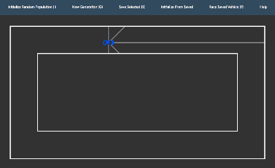

# evolutionary-self-driving

Play here: https://anthfgreco.github.io/evolutionary-self-driving/

Make a car learn to drive itself through neuro-evolution!

The only user input required is the selection of the best car (and some patience).

## Getting started
### Developing
- Clone or fork project then navigate to the project folder
- Start a local web server
